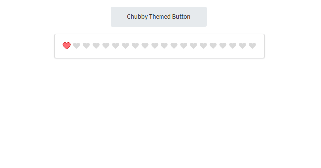

# How to use different Semantic UI themes in CRA

It is straightforward to setup the default theme of semantic ui inside a CRA (create-react-app) by following the instructions provided in the [documentation](https://react.semantic-ui.com/usage). However, it is not clear how to use a different theme inside a CRA.

An important point to understand: the CSS files described in the documentation (the CDN option and `semantic-ui-css` package option) contain styling for just the `default` style. In other words, a CSS file for other themes has not been provided. So creating a semantic css file with a different theme requires you to setup and build it yourself.

## Setup

1. have a CRA already setup
   - you can set one up with `npx create-react-app ./project-folder-to-create`
1. `npm install --save semantic-ui-react`
   - this installs `semantic-ui-react` so you can use styled elements as react components in your CRA
1. `npm install --save-dev semantic-ui gulp`
   - this installs `semantic-ui` which contains all of the files and build scripts required to create your own semantic ui css file
   - this installs `gulp`, a popular build tool in javascript that is required to build your semantic ui css file
   - after `semantic-ui` finishes installing, it will start asking setup questions
     1. choose `Express` setup
     1. for `Where should we put Semantic UI inside your project?`, type in `src/semantic/`
     1. select which components you will use (just make sure they are all green light/selected if you're not sure which you will use)
     1. when asked where `dist` files should go, the default value is fine (press enter)
     1. when asked `set permissions on outputted files?`, select `No`
1. inside `src/index.js`, add `import './semantic/dist/semantic.min.css';` - the `semantic.min.css` file you are importing will be generated once you finish the **Building** steps below

## Customization

1. to change what theme to use for components, open `src/semantic/src/theme.config` and change the name for one or more components from `'default'` to `'chubby'` (or some other theme name)
   - you can see all available theme names by observing folder names in `src/semantic/src/themes`

## Building

1. `cd src/semantic/`
   - this folder has a `gulpfile.js`, containing all the pre-defined build tasks
1. `$(npm bin)/gulp build`
   - this runs the `gulp` executable that you installed and tells it to run the build task called `build` (defined in the `gulpfile.js`)
   - note: `$(npm bin)` refers to `node_modules/.bin` -- some npm packages create command-line executables that are stored here

Now when you start your project (via `npm start`), the components that you import from `semantic-ui-react` will be styled by the theme you selected in the **Customization** section.

You can now change themes whenever you want, then rebuild the css file to see the changes in your CRA.

ref: https://github.com/Semantic-Org/Semantic-UI-CSS

## Preview

